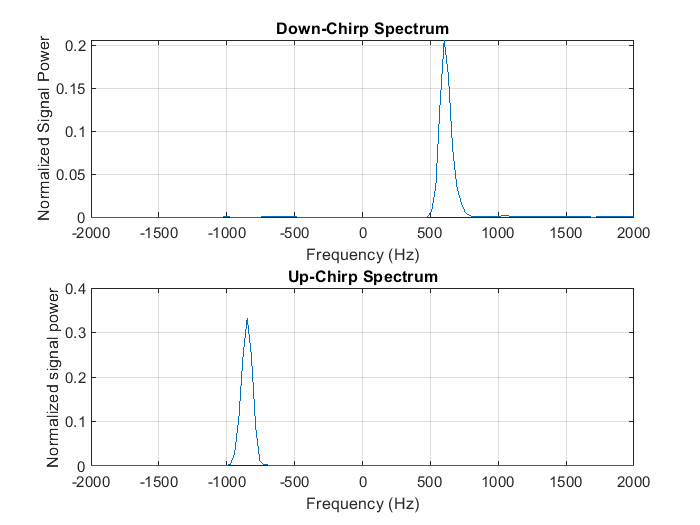

# 📡 FMCW Radar – Range & Velocity Estimation

This module implements frequency-modulated continuous wave (FMCW) radar processing in MATLAB.

The objective is to estimate both the **range** and **radial velocity** of a target from sampled complex baseband data obtained from up-chirp and down-chirp radar signals.

---

## 🎯 Problem Overview

In an FMCW radar:

- The transmitted signal is a frequency-modulated chirp
- The received echo produces a beat frequency
- The beat frequency depends on:
  - Target range
  - Target velocity (Doppler shift)

By processing one up-chirp and one down-chirp, range and velocity can be decoupled.

---

## 🔍 Signal Processing Steps

1. Acquire complex baseband samples from:
   - Up-chirp
   - Down-chirp

2. Apply Hann window to reduce spectral leakage

3. Compute FFT (oversampling ratio = 2)

4. Compute magnitude-squared spectrum

5. Suppress disturbing low-frequency and extreme-frequency components

6. Detect spectral peak

7. Compute:
   - Range
   - Radial velocity

---

## 🧠 Key DSP Concepts

### Spectral Leakage & Windowing

The discrete Fourier transform operates on a finite-length signal, which corresponds to multiplication by a rectangular window in time.

This causes spectral leakage, especially problematic when strong low-frequency clutter is present.

To mitigate this effect, a **Hann window** is applied.

---

## 📈 Results

The magnitude-squared spectra of both the down-chirp and up-chirp signals are shown below.  
A Hann window (oversampling ratio = 2) was applied prior to spectral analysis in order to suppress leakage from strong low-frequency components.



*Figure 1: Exemplary spectra of one down-chirp and one up-chirp. The peak indicate the detected target.*

### Properties of the Hann Window

The Hann window:

- Reduces sidelobe levels significantly
- Smoothly tapers the signal to zero at the edges
- Reduces leakage from strong spectral components
- Slightly widens the main lobe (trade-off between resolution and leakage)

In MATLAB:
```matlab
w = hann(N);
